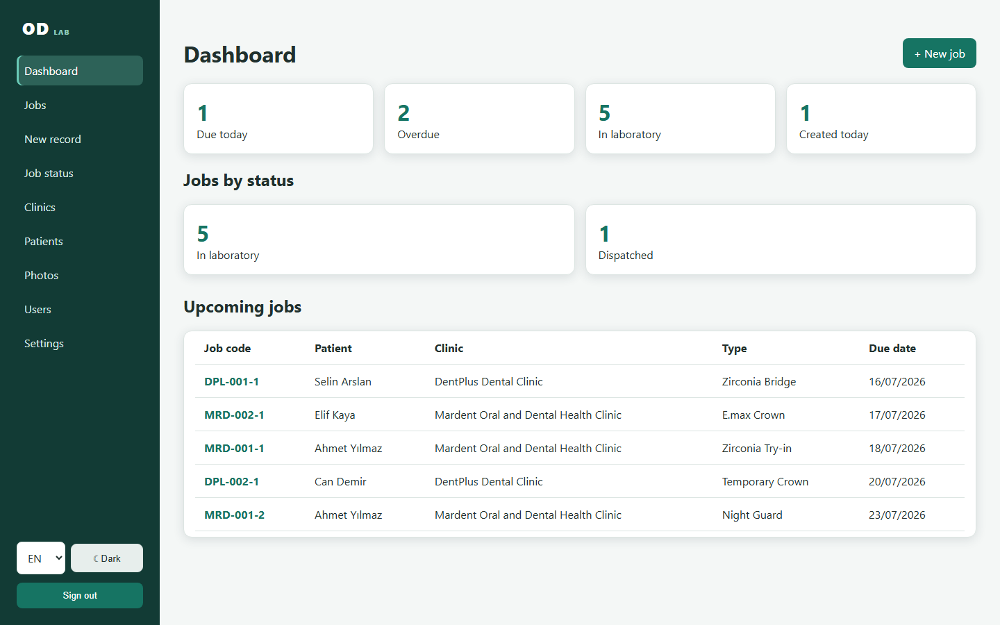
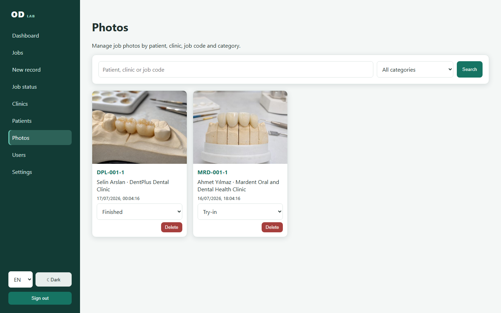

# OpenDental Lab

[English](README.md) · [Türkçe](README.tr.md) · [Deutsch](README.de.md)

OpenDental Lab ist eine quelloffene, lokale Auftragsverwaltung für Dentallabore. Eine einzelne Windows-Anwendung zeigt die Desktop-Verwaltung, stellt QR-Seiten für Mobilgeräte im vertrauenswürdigen LAN bereit, speichert Daten in SQLite und druckt 70 × 50 mm Etiketten direkt auf dem ausgewählten Windows-Drucker.

> Dieses unabhängige Projekt ist nicht mit dem etablierten Praxisverwaltungssystem Open Dental verbunden. „Lab“ kennzeichnet den Dentallabor-Fokus.

> **Demo- und Datenschutzhinweis:** Sämtliche Patienten- und Kliniknamen, Kontaktdaten, Aufträge, Daten, Notizen und Bildinhalte in diesem Repository, den Screenshots und der Demo-Datenbank sind vollständig fiktiv und zufällig zu Demonstrationszwecken erstellt. Sie beziehen sich nicht auf reale Personen, Patienten, Kliniken oder klinische Fälle.



## Funktionen

- Unveränderliche Patientencodes pro Klinik (`MRD-042`) und Auftragscodes pro Patient (`MRD-042-2`)
- Mehrere Aufträge und chronologische Laboraktivitäten unter einem Patienten
- QR-Link mit nicht erratbarem 80-Bit-Schlüssel ohne Patientennamen im QR-Inhalt
- QR + Code 128, nativer Direktdruck, Standarddrucker und integrierter PNG-Testdrucker
- Schneller Arbeitsablauf mit `Enter`, `F3`, `F9` und `F10`
- FDI-Zahnauswahl, Auftragsarten-/Materialkatalog, Standardmaterial und Digitalmodell-Kennzeichen
- Suche nach Patient, Klinik, Codes und USB-Barcodescanner
- Mobile Foto- und Notiz-Uploads ohne App-Installation
- Sichere JPEG/PNG/WebP-Prüfung, Zufallsnamen, Metadatenentfernung, Skalierung und Vorschaubilder
- Filterbare Galerie, Großansicht, Kategorieänderung und berechtigtes Löschen
- Türkische, englische und deutsche Oberfläche; helles und dunkles Design
- Administrator-, Mitarbeiter- und Nur-Lesen-Rollen mit vollständiger Benutzerbearbeitung
- QR-Sperrung/-Erneuerung, Statusverlauf und ZIP-Sicherung mit einem Klick
- Swagger/OpenAPI und für eine spätere Android-Share-App vorbereitete Endpunkte



## Einzelne Windows-Anwendung

`OpenDentalLab-Windows-x64-v1.4.0-test.zip` entpacken und `OpenDentalLab.exe` starten. Terminal, Browser, Node.js und .NET sind nicht erforderlich. Daten bleiben unter `%LOCALAPPDATA%\OpenDentalFlow` erhalten.

Erster Administrator: `admin` / `Admin123!`<br>
Vor echten Patientendaten das Passwort ändern. Die Anmeldefelder sind absichtlich leer.

## Entwicklung

Voraussetzungen: Windows 10/11 x64, .NET 8 SDK, Node.js 20+ und Edge WebView2 Runtime.

```powershell
git clone https://github.com/Teknoist/OpenDentalFlow.git
cd OpenDentalFlow
dotnet restore
cd frontend
npm install
npm run build
```

```powershell
dotnet run --project backend/OpenDentalFlow.Api
```

Für die Vite-Entwicklung in einem zweiten Terminal:

```powershell
cd frontend
npm run dev -- --host 0.0.0.0
```

Swagger: `http://localhost:5080/swagger`

## Datenbank und Demo-Daten

Migrationen werden beim Start automatisch ausgeführt. Manuell:

```powershell
dotnet tool install --global dotnet-ef --version 8.*
dotnet ef database update --project backend/OpenDentalFlow.Api --startup-project backend/OpenDentalFlow.Api
```

Eine neue leere Installation erhält realistische, vollständig synthetische Kliniken, Patienten, Aufträge, Aktivitäten, Notizen und zwei Laborbilder. Alle dargestellten Namen, Datensätze und Bildinhalte sind ausschließlich für die Demo fiktiv und zufällig erstellt; sie enthalten keine realen Patienten-, Klinik- oder Identitätsdaten. Vorhandene Installationen werden nie überschrieben.

## Lokales Netzwerk, Firewall und `lab.local`

1. Server-PC und Telefone mit demselben vertrauenswürdigen LAN/WLAN verbinden.
2. IPv4-Adresse mit `ipconfig` ermitteln.
3. `http://SERVER-IP:5080` am Telefon testen.
4. Unter **Einstellungen → QR-Basisadresse** diese Adresse oder besser `http://lab.local:5080` speichern.
5. Vor dauerhaften Etiketten den exakten QR-Link testen.

Windows-Firewall nur für das private Profil:

```powershell
New-NetFirewallRule -DisplayName "OpenDental Lab LAN" -Direction Inbound -Protocol TCP -LocalPort 5080 -Action Allow -Profile Private
```

Ein lokaler DNS-Eintrag und eine DHCP-Reservierung im Router sind für `lab.local` am zuverlässigsten. Pi-hole oder AdGuard Home sind ebenfalls geeignet. Ein stabiler Hostname schützt alte QR-Etiketten bei IP-Änderungen.

## Thermodrucker

Windows-Treiber des Herstellers installieren und ein randloses Papierformat 70 × 50 mm anlegen. Unter **Einstellungen → Standard-Etikettendrucker** auswählen. `F10` sendet das Etikett ohne Browser-Dialog direkt an Windows.

Ohne Hardware **OpenDental Test Printer (PNG)** wählen. Testetiketten werden mit 200 DPI unter `%LOCALAPPDATA%\OpenDentalFlow\TestPrints` gespeichert.

## Sicherheit

- Nicht direkt im öffentlichen Internet betreiben.
- Startpasswort und Beispiel-JWT-Schlüssel vor echtem Einsatz ändern.
- QR-Zugriff kann keine Stammdaten ändern, Patienten/Aufträge löschen, Kliniken wechseln oder Benutzer verwalten.
- Uploads werden nach MIME-Typ, Dateisignatur und Dekodierbarkeit geprüft; Client-Dateinamen werden nie als Speicherpfad benutzt.
- Patientendaten sind sensibel. Einwilligungs-, Aufbewahrungs-, Zugriffs-, Lösch- und Sicherungsregeln gemäß lokaler Rechtslage festlegen.
- Verschlüsselte Sicherungskopien außerhalb des Labor-PCs speichern und Wiederherstellung regelmäßig prüfen.

## Annahmen

- Eine Installation steht für ein Labor.
- SQLite eignet sich für einen lokalen Server und Tausende indizierter Aufträge. Für mehrere Standorte oder hohe parallele Schreibraten PostgreSQL/SQL Server verwenden.
- Das MVP nutzt zustandslose 12-Stunden-JWT-Sitzungen; Refresh-Token und Selbsthilfe-Passwortwiederherstellung sind nicht enthalten.
- Eine Android-App ist nicht Teil des MVP; die API ist für eine spätere Share-Intent-App vorbereitet.
- Preise, Rechnungen und Cloud-Synchronisation liegen außerhalb dieses MVP.

## Tests und Paket

```powershell
dotnet build OpenDentalFlow.sln
dotnet test OpenDentalFlow.sln
cd frontend
npm run build
```

Windows-Paket erstellen: `.\build-windows.ps1`

## Lizenz

[MIT](LICENSE).
