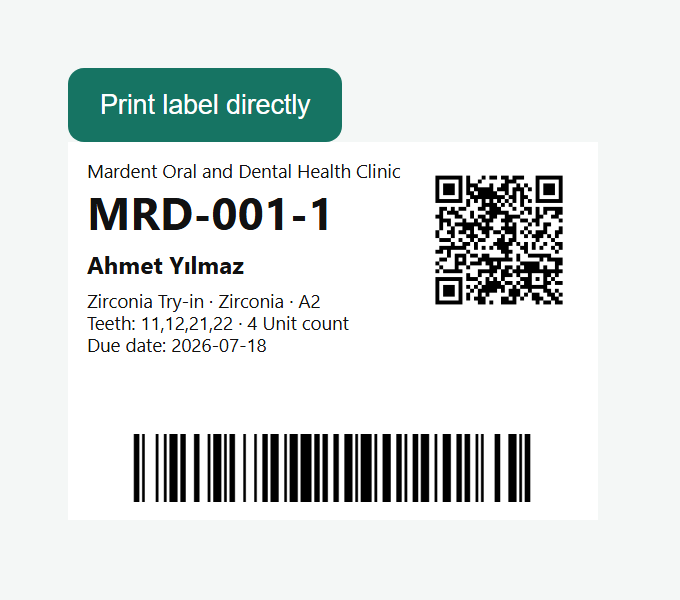

# OpenDental Lab

[English](README.md) · [Türkçe](README.tr.md) · [Deutsch](README.de.md)

OpenDental Lab is an open-source, local-network-first case tracking application for dental laboratories. A single Windows application provides the desktop management UI, hosts the mobile QR pages for trusted LAN devices, stores data in SQLite and prints 70 × 50 mm labels directly to a selected Windows printer.

> This independent project is not affiliated with the established Open Dental practice-management product. “Lab” is part of the displayed name to make its dental-laboratory scope clear.

> **Demo privacy notice:** Every patient and clinic name, contact detail, job, date, note and image shown in this repository, its screenshots and the seeded demo database is entirely fictional and randomly created for demonstration. None represents or refers to a real person, patient, clinic or clinical case.


## Highlights

- Immutable clinic-based patient codes (`MRD-042`) and per-patient job codes (`MRD-042-2`) protected by transactions and unique constraints.
- One patient record can contain multiple jobs and a chronological laboratory activity history.
- QR URLs contain only an unpredictable 80-bit access token; no patient name is embedded in the code.
- Code 128 and QR label, native silent printing, configurable default printer and a built-in PNG test printer.
- Fast keyboard workflow: `Enter` advances fields, `F3` opens job search, `F9` saves and `F10` saves then prints.
- FDI tooth selector, type/material catalog, automatic default material, digital-model flag and duplicate-patient warning.
- Search by patient, clinic, patient/job code or USB barcode scanner input.
- Responsive public job page for camera/gallery uploads and notes without installing an app.
- Secure photo pipeline: JPEG/PNG/WebP signature validation, decode verification, random names, EXIF removal by re-encoding, resizing, thumbnails and configurable size limit.
- Searchable gallery with category filters, full-size preview, category editing, missing-file fallback and authorized deletion.
- Turkish, English and German UI; persistent light/dark themes.
- Administrator, employee and view-only roles; user editing, password reset and activation controls.
- One-click SQLite + photo ZIP backup and administrator-controlled QR revocation/regeneration.
- Swagger/OpenAPI and Android share-intent-ready lookup, multi-upload and note endpoints.


## Barcode and label workflow



- Each job has one immutable human-readable job code, for example `MRD-001-1`.
- The linear barcode is **Code 128** and contains only that job code. It does not contain the patient name, notes, photo data or QR access token.
- The QR code is separate. It contains the configured LAN URL plus the job's unpredictable public access token and opens the limited mobile job page.
- The label preview obtains both images from `GET /api/jobs/{id}/label`; standalone PNG endpoints are also available at `/label/barcode` and `/label/qr`.
- A USB barcode scanner normally behaves like a keyboard. Keep the quick-search field focused, scan the label and let the scanner send its configured `Enter/CR` suffix. The UI calls the exact job-code lookup and opens that job directly.
- `F9` saves without printing. `F10` saves and sends the 70 × 50 mm label directly to the Windows printer selected in Settings, without a browser print dialog.
- Select **OpenDental Test Printer (PNG)** to test without hardware. For physical scanners, enable Code 128 and configure an `Enter` suffix in the scanner manual.

The printed label may visibly show the patient name for laboratory handling, but neither the Code 128 barcode nor the QR URL embeds that name. The native print service is abstracted for future ZPL/TSPL transports.

## Technology

- ASP.NET Core 8 Web API, Entity Framework Core and SQLite
- React, TypeScript and Vite
- WPF + WebView2 standalone Windows shell
- QRCoder, BarcodeLib, SkiaSharp, BCrypt and JWT
- xUnit tests and EF Core migrations

## One-click Windows package

Extract `OpenDentalLab-Windows-x64-v1.4.0-test.zip` and run `OpenDentalLab.exe`. No terminal, browser, Node.js or .NET installation is needed. The app opens in its own desktop window and serves trusted phones on TCP port `5080`.

Persistent data is stored outside the application directory:

```text
%LOCALAPPDATA%\OpenDentalFlow\
  opendentalflow.db
  uploads\
  backups\
  TestPrints\
```

Upgrades therefore do not overwrite the database or photos.

Initial administrator: `admin` / `Admin123!`<br>
Change this password before entering real patient data. Login fields intentionally open empty.

## Development setup

Requirements: Windows 10/11 x64, .NET 8 SDK, Node.js 20+ and Edge WebView2 Runtime.

```powershell
git clone https://github.com/Teknoist/OpenDentalFlow.git
cd OpenDentalFlow
dotnet restore
cd frontend
npm install
npm run build
```

Run the API/desktop shell:

```powershell
dotnet run --project backend/OpenDentalFlow.Api
```

For frontend development, keep the API running and start Vite:

```powershell
cd frontend
npm run dev -- --host 0.0.0.0
```

- Desktop/API: `http://localhost:5080`
- Vite: `http://localhost:5173`
- Swagger: `http://localhost:5080/swagger`

## Database and demo data

Pending migrations run automatically at startup. Manual migration:

```powershell
dotnet tool install --global dotnet-ef --version 8.*
dotnet ef database update --project backend/OpenDentalFlow.Api --startup-project backend/OpenDentalFlow.Api
```

A new empty installation receives realistic synthetic demo clinics, patients, jobs, activities, notes and two AI-generated laboratory images. All displayed names, records and image contents are fictional and randomly created exclusively for demonstration; they contain no real patient, clinic or identifying data. Seeding runs only when the user table is empty and never replaces an existing installation.

## Local network and `lab.local`

1. Connect the server PC and phones to the same trusted LAN/Wi-Fi.
2. Find the server IPv4 address with `ipconfig`.
3. Test `http://SERVER-IP:5080` on a phone. Port `5173` is development-only and must not be used by the packaged application.
4. In **Settings**, set the QR base URL to that address or preferably `http://lab.local:5080`.
5. Test the exact QR URL before printing permanent labels.

Allow only the Private Windows network profile:

```powershell
New-NetFirewallRule -DisplayName "OpenDental Lab LAN" -Direction Inbound -Protocol TCP -LocalPort 5080 -Action Allow -Profile Private
```

A router DNS reservation/local DNS entry is the most reliable `lab.local` solution. Pi-hole or AdGuard Home also works. A Windows `hosts` entry helps Windows clients, but Android normally needs router/local DNS. A stable hostname prevents old printed QR labels from breaking after DHCP changes.

## Thermal printing

Install the printer manufacturer’s Windows driver and create a borderless 70 × 50 mm paper profile. Select it under **Settings → Default label printer**. `F10` sends the label directly through the native Windows print layer without opening a browser dialog.

For hardware-free testing, select **OpenDental Test Printer (PNG)**. Labels are saved under `%LOCALAPPDATA%\OpenDentalFlow\TestPrints` at 200 DPI. The print service is abstracted so ZPL and TSPL transports can be added later.

## Security notes

- Do not expose this MVP directly to the public internet.
- Replace the sample JWT key and initial password before real use.
- QR access is deliberately limited: it cannot edit core records, change clinics, delete patients/jobs, show prices or manage users.
- Public QR endpoints are rate-limited; management endpoints require JWT and role authorization.
- EF Core parameterizes SQL; database constraints are the final concurrency guard.
- Uploads reject unsupported or corrupt content and never use client filenames as storage paths.
- Patient data is sensitive. Define lawful consent, retention, access, audit and backup policies for your jurisdiction.
- Keep encrypted copies of the generated backups outside the laboratory PC and test restoration regularly.

## Assumptions

- One installation represents one laboratory; clinic short codes are unique within it.
- The MVP uses 12-hour stateless JWT sessions. Refresh tokens and self-service recovery are not included.
- SQLite is appropriate for a single local server and thousands of indexed jobs; move to PostgreSQL/SQL Server for multi-site or high-write deployments.
- Android is not required for the MVP. Existing endpoints support a later Android share-intent client.
- Pricing, invoicing and internet/cloud synchronization are intentionally outside this case-tracking MVP.

## Validation and packaging

```powershell
dotnet build OpenDentalFlow.sln
dotnet test OpenDentalFlow.sln
cd frontend
npm run build
```

Create the self-contained Windows package from the repository root:

```powershell
.\build-windows.ps1
```

## License

[MIT](LICENSE). Contributions in Turkish, English or German are welcome.
